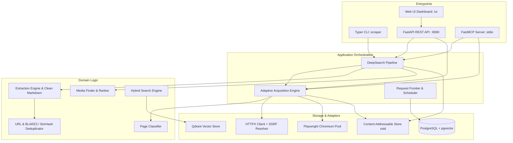

# DeepSearch

> **Adaptive Web Scraping, Multivector Retrieval & Deep Research Engine**

[English](README.md) • [Русский](README.ru.md)

[](tests/)
[](pyproject.toml)
[](LICENSE)
[](docs/MCP_GUIDE.md)
[](scraper/api/app.py)

DeepSearch is an adaptive web scraping, content extraction, and autonomous research platform. It evaluates target URLs at runtime to execute the **minimal effective cost tier**—routing between low-overhead HTTP, direct API discovery, headless Playwright Chromium, and visual multivector layout extraction (PixelRAG).

```
Target URL / Search Query
         │
         ▼
┌────────────────────────────────────────────────────────────────────────┐
│                        Minimal Effective Cost Tier                      │
│                                                                        │
│   L0: CAS Cache ──► L1: HTTP ──► L2: API ──► L3: Browser ──► L4: Visual│
│   (BLAKE3 Hash)    (HTTPX)     (JSON)    (Playwright)   (PixelRAG)     │
└───────────────────────────────────┬────────────────────────────────────┘
                                    │
                                    ▼
┌────────────────────────────────────────────────────────────────────────┐
│                       Autonomous Research Engine                       │
│                                                                        │
│   • Discovery: OpenAlex, Crossref, Semantic Scholar, Europe PMC,       │
│     PubMed, ArXiv, Regional Academic, Wikipedia, Anna's Archive        │
│   • Acquisition: Open Access direct PDF resolver & unpaywall fallbacks │
│   • Media Pipeline: Topic image scoring, PDF figure & chart extraction │
│   • Dual-Format Output: files/ (links & media) + rag/ (LLM dataset)    │
└───────────────────────────────────┬────────────────────────────────────┘
                                    │
                                    ▼
           CLI (`scraper`)  │  REST API (:8080)  │  MCP Stdio Server
```

---

## Why DeepSearch

Standard web scrapers force a single rigid approach: lightweight HTTP fetchers fail on JavaScript-heavy SPAs, while full-browser headless scrapers are 10–30x slower, resource-heavy, and easily blocked.

DeepSearch resolves this by combining real-time DOM intelligence with cost-governed execution:

* **Adaptive Escalation**: Scores target pages for static markup ratio, JS dependency, and dynamic API endpoints before deciding whether to launch a headless browser.
* **Autonomous Research Pipeline**: Discovers academic, medical, and encyclopedic sources, extracts full text from HTML/PDFs, scores relevant media figures, and exports ready-to-use RAG datasets.
* **Production-Grade Resilience**: Built-in host-aware token-bucket rate limiting, 3-level deduplication, self-healing CSS/XPath selectors, and SSRF pre-flight DNS blocking.
* **Native AI Agent Protocols**: Full Model Context Protocol (MCP) server integration for Claude Desktop, Cursor, Claude Code, VS Code, and custom microservices.

---

## Key Features

* **Minimal Effective Cost Decision Policy**: Dynamically routes requests through 6 cost tiers (L0 Cache, L1 HTTP, L2 Direct API, L3 Playwright Browser, L4–L5 Visual/PixelRAG).
* **Page Intelligence Engine**: Analyzes DOM structure to compute `static_score`, `js_dependency_score`, `api_score`, `visual_score`, and canvas detection.
* **Autonomous Research Pipeline**: End-to-end multi-source discovery (ArXiv, Europe PMC, PubMed, Wikipedia, Anna's Archive) exporting dual-structure `.zip` archives with `files/` (links & media) and `rag/` (LLM-ready context chunks).
* **Content Addressable Storage (CAS)**: Zstandard (`zstd`) compressed local filesystem storage keyed by BLAKE3 cryptographic hashes.
* **3-Level Deduplication**: Normalizes URLs (strips tracking query parameters), checks exact BLAKE3 content hashes, and evaluates 64-bit SimHash Hamming distance.
* **Resilient Extraction**: Generates sanitized Clean Markdown and Fit Markdown, converts tables to Markdown/CSV/JSON, and auto-repairs selectors via DOM fingerprinting.
* **Full Multi-Interface Access**: Provides Typer CLI (`scraper`), FastAPI REST service (`:8080`), and FastMCP stdio server.

---

## Quick Start

### 1. Requirements

* **Python**: 3.11, 3.12, or 3.13
* **Operating System**: Linux, macOS, or Windows
* **Optional Backends**: PostgreSQL 16+ (pgvector), Redis 7+, Qdrant 1.8+ (for persistent vector indexing)

### 2. Installation (Recommended)

```bash
# Clone repository
git clone https://github.com/your-repo/deepsearch.git
cd deepsearch

# Create and activate virtual environment
python -m venv .venv
# On Windows:
.venv\Scripts\activate
# On Linux/macOS:
source .venv/bin/activate

# Install in editable mode with development dependencies
pip install -e ".[dev]"

# Install Playwright Chromium headless browser engine
playwright install chromium
```

Verify the installation by running the test suite:

```bash
pytest tests/unit
# Expected: 54 passed in ~60s
```

---

## Usage

### 1. Command Line Interface (CLI)

The CLI entry point is `scraper`.

#### URL Diagnostic Inspection (`scraper inspect`)
Analyzes page intelligence heuristics, JS dependencies, and returns the recommended strategy:

```bash
scraper inspect https://news.ycombinator.com
```

#### Run Autonomous Deep Research (`scraper research`)
Discovers candidate sources, downloads topic images, extracts PDF/HTML text, and produces a structured research archive:

```bash
scraper research --query "quantum computing error correction" --depth 2 --max-pages 20 --output quantum_research.zip
```

Expected output:
```text
Total Pages Processed: 18
Total RAG Chunks Generated: 112
Total Media Images Archived: 14
Archive Generated Successfully at: quantum_research.zip
```

#### Adaptive Crawl (`scraper crawl`)
Crawls a website with automatic browser escalation:

```bash
scraper crawl https://example.com --depth 3 --max-pages 50 --mode balanced
```

#### Content & Markdown Extraction (`scraper extract`)
Extracts token-optimized clean Markdown from target URL:

```bash
scraper extract https://example.com/article
```

#### Interactive Browser for Auth & Captchas (`scraper auth_browser`)
Launches a persistent browser session for manual authentication or captcha solving:

```bash
scraper auth_browser --url "https://target-portal.com" --profile ".browser_profile"
```

---

### 2. Model Context Protocol (MCP) Server

DeepSearch includes a native stdio FastMCP server exposing 5 tools to AI agents:

| MCP Tool | Description |
|---|---|
| `deepsearch_research` | Runs end-to-end research pipeline and outputs `.zip` archive (`files/` + `media/` + `rag/`). |
| `deepsearch_discover` | Discovers seed URLs across ArXiv, Europe PMC, PubMed, Wikipedia, and Anna's Archive. |
| `deepsearch_inspect` | Analyzes target URL heuristics, static score, JS dependency, and estimated cost. |
| `deepsearch_extract` | Converts HTML to token-optimized Clean Markdown and extracts structured tables. |
| `deepsearch_search` | Performs hybrid text vector and visual multivector search over indexed data. |

#### Starting the MCP Server

```bash
# Via CLI command
scraper mcp

# Or via management utility
python scripts/mcp_manager.py start
```

#### Verifying MCP Health

```bash
python scripts/mcp_manager.py test
```

#### Client Configuration (Claude Desktop / Cursor / VS Code)

Add to `claude_desktop_config.json`:

```json
{
  "mcpServers": {
    "deepsearch": {
      "command": "uv",
      "args": [
        "--directory",
        "/path/to/deepsearch",
        "run",
        "python",
        "-m",
        "scraper.mcp.server"
      ]
    }
  }
}
```

*For detailed connection examples in Python and Go, see [MCP Client Connectivity Guide](docs/MCP_CLIENT_CONNECTIVITY.md).*

---

### 3. REST API Service

Launch the FastAPI server:

```bash
uvicorn scraper.api.app:app --host 0.0.0.0 --port 8080
```

* **Interactive API Documentation (Swagger UI)**: `http://localhost:8080/docs`
* **Web Monitoring Dashboard**: `http://localhost:8080/ui`
* **Health Check**: `GET http://localhost:8080/api/v1/health`

#### Example: Inspect Endpoint
```bash
curl -X POST "http://localhost:8080/api/v1/inspect" \
  -H "Content-Type: application/json" \
  -d '{"url": "https://news.ycombinator.com"}'
```

#### Example: Execute Research Pipeline
```bash
curl -X POST "http://localhost:8080/api/v1/research" \
  -H "Content-Type: application/json" \
  -d '{
    "query": "photopolymer resin mechanical properties",
    "depth": 2,
    "max_pages": 20,
    "mode": "balanced",
    "export_archive": true
  }'
```

---

### 4. Docker Deployment

Launch the complete backend stack (API, PostgreSQL with pgvector, Redis, Qdrant, MinIO) with Docker Compose:

```bash
docker compose up --build -d
```

Service mapping:
* **FastAPI Server**: `http://localhost:8080`
* **Qdrant Vector DB**: `http://localhost:6333`
* **PostgreSQL + pgvector**: `localhost:5432`
* **Redis**: `localhost:6379`
* **MinIO Console**: `http://localhost:9001` (`minioadmin` / `minioadmin`)

---

## Output Structure of Research Archives

Executing `scraper research` or calling `deepsearch_research` generates a structured `.zip` archive designed for human review and direct LLM ingestion:

```text
research_output.zip
├── manifest.json              # Run metadata, query parameters, inventory, and stats
├── files/                     # Clean Markdown pages with source URL links
│   ├── doc_01_overview.md
│   └── doc_02_analysis.md
├── media/                     # 5–25 scored topic figures and diagrams
│   ├── img_01_state_diagram.png
│   └── img_02_benchmark_chart.jpg
└── rag/                       # Token-optimized context datasets for LLM reasoning
    ├── rag_context.md         # Consolidated Markdown summary & media gallery
    ├── rag_chunks.jsonl       # Chunked passages with source attribution
    ├── rag_dataset.json       # Structured QA context dataset
    └── vector_index.json      # Metadata index for vector retrieval
```

---

## Configuration

Configuration is managed through environment variables or a `.env` file using Pydantic BaseSettings. Nested settings use double underscores (`__`).

| Variable | Type | Default | Description |
|---|---|---|---|
| `APP_NAME` | `str` | `DeepSearch Adaptive Scraper` | Application display name |
| `APP_VERSION` | `str` | `1.0.0` | Application version |
| `MODE` | `str` | `balanced` | Execution mode: `fast`, `balanced`, `complete`, `research`, `archive` |
| `API_HOST` | `str` | `0.0.0.0` | REST API host binding |
| `API_PORT` | `int` | `8080` | REST API port |
| `API_KEY` | `str` | `dev-secret` | Authentication token |
| `DATABASE_URL` | `str` | `postgresql+asyncpg://...` | PostgreSQL async connection DSN |
| `REDIS_URL` | `str` | `redis://localhost:6379/0` | Redis queue & lock connection DSN |
| `QDRANT_URL` | `str` | `http://localhost:6333` | Qdrant vector database URL |
| `STORAGE_PATH` | `str` | `./data/storage` | Local Content Addressable Storage root |
| `ADAPTIVE__BROWSER_THRESHOLD` | `float` | `0.70` | JS dependency score threshold for Playwright escalation |
| `ADAPTIVE__VISUAL_THRESHOLD` | `float` | `0.65` | Visual score threshold for PixelRAG indexing |
| `LIMITS__DEFAULT_HOST_RPS` | `float` | `5.0` | Max requests per second per target host |
| `LIMITS__MAX_HOST_CONCURRENCY` | `int` | `8` | Max concurrent requests per target host |
| `SECURITY__BLOCK_PRIVATE_IPS` | `bool` | `true` | SSRF protection: block private & loopback IP subnets |
| `SECURITY__MAX_RESPONSE_SIZE_BYTES`| `int`| `104857600` (100MB) | Max raw HTTP response size |
| `BUDGET__MAX_PAGES` | `int` | `50000` | Hard cap on crawled pages per job |

*For complete configuration options, see [Configuration Guide](docs/CONFIGURATION.md).*

---

## Architecture

DeepSearch enforces a **Clean Layered Architecture (Dependency DAG)**:



### Module Organization

```text
scraper/
├── acquisition/         # HTTP fetcher, Playwright browser pool, proxy & session managers
├── api/                 # FastAPI routes, schemas, and app factory
├── cli/                 # Typer command-line application
├── config.py            # Pydantic BaseSettings & operational sub-configs
├── contracts/           # Data models, interfaces, and protocol definitions
├── control/             # Host rate limiter (token bucket), scheduler, budget tracker
├── discovery/           # Link extraction, robots.txt parser, multi-source seed finder
├── extraction/          # Markdown sanitizer, table converter, self-healing selectors, OCR
├── mcp/                 # Model Context Protocol (FastMCP) server & tools
├── monitoring/          # OpenTelemetry tracing and Prometheus telemetry
├── normalization/       # URL canonicalizer and SimHash/BLAKE3 deduplicator
├── pipeline/            # End-to-end deep research orchestrator
├── search/              # Hybrid text and visual multivector search engine
├── storage/             # Content Addressable Storage (CAS), PostgreSQL models, Qdrant adapter
├── ui/                  # Dashboard template and HTML renderer
└── visual/              # Spatial screenshot tiling and PixelRAG multi-vector representations
```

---

## Platform Support & Compatibility

| Component | Linux | macOS | Windows | Notes |
|---|---|---|---|---|
| **Python Runtime** | ✅ 3.11–3.13 | ✅ 3.11–3.13 | ✅ 3.11–3.13 | Tested on Python 3.13.7 |
| **Playwright Engine** | ✅ Chromium | ✅ Chromium | ✅ Chromium | Headless & headed supported |
| **CLI (`scraper`)** | ✅ Supported | ✅ Supported | ✅ Supported | Cross-platform Typer + Rich |
| **FastMCP Server** | ✅ Supported | ✅ Supported | ✅ Supported | JSON-RPC 2.0 over stdio |
| **Docker Compose** | ✅ Supported | ✅ Supported | ✅ Supported | PostgreSQL + Redis + Qdrant + MinIO |

---

## Troubleshooting

### 1. Playwright Chromium Executable Missing
* **Symptom**: `playwright._impl._errors.Error: Executable doesn't exist at...`
* **Fix**: Install the Chromium binary:
  ```bash
  playwright install chromium
  ```

### 2. SSRF Policy Blocks Local Addresses
* **Symptom**: `SecurityViolationError: SSRF policy blocked access to private IP...`
* **Cause**: By default, `SECURITY__BLOCK_PRIVATE_IPS=true` prevents requests to private subnets (`127.0.0.1`, `192.168.x.x`, `10.x.x.x`).
* **Fix**: If you are testing local mock services, disable the check in `.env`:
  ```env
  SECURITY__BLOCK_PRIVATE_IPS=false
  ```

### 3. Module Import Errors in Tests
* **Symptom**: `ModuleNotFoundError: No module named 'scraper'`
* **Fix**: Install the package in editable mode:
  ```bash
  pip install -e .
  ```
  Or set `PYTHONPATH`:
  ```bash
  # Linux/macOS:
  export PYTHONPATH=.
  # Windows PowerShell:
  $env:PYTHONPATH="."
  ```

---

## Documentation Index

| Guide | Description |
|---|---|
| [User Guide](docs/USER_GUIDE.md) | Comprehensive usage workflows for CLI, REST API, and Docker. |
| [Architecture Reference](docs/ARCHITECTURE.md) | Detailed Clean Architecture layers, lifecycle, and component interactions. |
| [CLI Reference](docs/CLI_REFERENCE.md) | Full command, option, and argument manual for `scraper`. |
| [Configuration Reference](docs/CONFIGURATION.md) | All environment variables, defaults, and tuning parameters. |
| [MCP Server Guide](docs/MCP_GUIDE.md) | Setup instructions for Claude Desktop, Cursor, and VS Code. |
| [MCP Client Connectivity](docs/MCP_CLIENT_CONNECTIVITY.md) | Integration guide and code samples for Python and Go clients. |
| [REST API Examples](docs/API_EXAMPLES.md) | `curl` command samples for all 9 REST endpoints. |
| [OpenAPI Specification](docs/openapi.yaml) | Standard OpenAPI 3.0 contract for the REST API. |
| [Roadmap](docs/ROADMAP.md) | Implemented milestones and upcoming capabilities. |

---

## License

This project is licensed under the **Apache License 2.0**. See the [LICENSE](LICENSE) file for details.