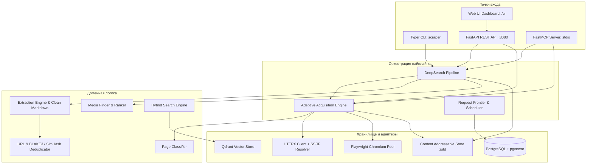

# DeepSearch

> **Платформа адаптивного веб-парсинга, мультивекторного поиска и автономного ресёрча**

[English](README.md) • [Русский](README.ru.md)

[](tests/)
[](pyproject.toml)
[](LICENSE)
[](docs/MCP_GUIDE.md)
[](scraper/api/app.py)

DeepSearch — это адаптивная платформа для веб-скрейпинга, извлечения контента и проведения глубоких автономных исследований. Система в реальном времени анализирует структуру целевых страниц и выбирает **минимально эффективный уровень исполнения (Minimal Effective Cost Tier)** — динамически переключаясь между легковесным HTTP, прямым API, headless-браузером Playwright Chromium и мультивекторным визуальным извлечением макета (PixelRAG).

```
Целевой URL / Поисковый запрос
             │
             ▼
┌────────────────────────────────────────────────────────────────────────┐
│                   Минимально эффективный уровень (Cost Tier)           │
│                                                                        │
│   L0: CAS Cache ──► L1: HTTP ──► L2: API ──► L3: Browser ──► L4: Visual│
│   (BLAKE3 Hash)    (HTTPX)     (JSON)    (Playwright)   (PixelRAG)     │
└───────────────────────────────────┬────────────────────────────────────┘
                                    │
                                    ▼
┌────────────────────────────────────────────────────────────────────────┐
│                   Автономный исследовательский движок                  │
│                                                                        │
│   • Поиск: OpenAlex, Crossref, Semantic Scholar, Europe PMC, PubMed,   │
│     ArXiv, Regional Academic, Wikipedia, Anna's Archive                │
│   • Извлечение: Open Access Direct PDF Resolver + unpaywall шлюзы     │
│   • Медиа-пайплайн: скоринг иллюстраций, извлечение графиков из PDF    │
│   • Двухуровневый архив: files/ (ссылки + медиа) и rag/ (датасет LLM)  │
└───────────────────────────────────┬────────────────────────────────────┘
                                    │
                                    ▼
           CLI (`scraper`)  │  REST API (:8080)  │  MCP Stdio Server
```

---

## Почему DeepSearch

Традиционные скрейперы заставляют выбирать крайности: легковесные HTTP-клиенты падают на современных SPA с JavaScript, а постоянный запуск браузеров в 10–30 раз медленнее, потребляет гигабайты памяти и быстрее блокируется антибот-системами.

DeepSearch решает эту проблему благодаря интеллектуальной эскалации:

* **Адаптивная эскалация**: Оценивает долю статического HTML, зависимость от JS и наличие скрытых REST API до принятия решения о запуске браузера.
* **Автономный ресёрч-пайплайн**: Автоматически находит научные, медицинские и энциклопедические статьи, извлекает текст из HTML и PDF, отбирает релевантные схемы и графики и формирует готовые RAG-датасеты.
* **Инженерная надёжность**: Встроенный token-bucket рейт-лимитер для каждого хоста, 3-уровневая дедупликация, самовосстанавливающиеся селекторы и защита от SSRF (блокировка приватных IP-диапазонов).
* **Нативная поддержка AI-агентов**: Сервер Model Context Protocol (MCP) со stdio-транспортом для Claude Desktop, Cursor, Claude Code, VS Code и внешних микросервисов.

---

## Ключевые возможности

* **Минимально эффективная маршрутизация**: 6 уровней стоимости (L0 Cache, L1 HTTP, L2 Direct API, L3 Playwright Browser, L4–L5 Visual/PixelRAG).
* **Page Intelligence Engine**: Анализ структуры DOM с расчётом `static_score`, `js_dependency_score`, `api_score`, `visual_score` и детекцией canvas-элементов.
* **Автономный исследовательский пайплайн**: Мультидоменный поиск (ArXiv, Europe PMC, PubMed, Wikipedia, Anna's Archive) с экспортом `.zip` архивов: `files/` (Markdown со ссылками на источники) и `rag/` (чанкованный контекст для LLM).
* **Content Addressable Storage (CAS)**: Локальное хранилище со сжатием Zstandard (`zstd`) и индексацией по криптографическим BLAKE3-хешам.
* **3-уровневая дедупликация**: Каноникализация URL (удаление трекинговых меток), сверка BLAKE3-хешей контента и вычисление расстояния Хэмминга по 64-битному SimHash.
* **Устойчивое извлечение контента**: Преобразование HTML в оптимизированный Clean Markdown и Fit Markdown, конвертация таблиц в Markdown/CSV/JSON, самовосстановление селекторов по DOM-отпечаткам.
* **Универсальный доступ**: Typer CLI (`scraper`), REST API на FastAPI (`:8080`) и FastMCP stdio-сервер.

---

## Быстрый старт (Quick Start)

### 1. Требования к окружению

* **Python**: 3.11, 3.12 или 3.13
* **Операционная система**: Linux, macOS или Windows
* **Опциональные сервисы**: PostgreSQL 16+ (с pgvector), Redis 7+, Qdrant 1.8+ (для векторного поиска)

### 2. Установка (Рекомендуемый способ)

```bash
# Клонирование репозитория
git clone https://github.com/your-repo/deepsearch.git
cd deepsearch

# Создание и активация виртуального окружения
python -m venv .venv
# В Windows (PowerShell):
.venv\Scripts\activate
# В Linux/macOS:
source .venv/bin/activate

# Установка пакета в режиме разработки
pip install -e ".[dev]"

# Установка браузерного движка Playwright Chromium
playwright install chromium
```

Проверка корректности установки запуском набора тестов:

```bash
pytest tests/unit
# Ожидаемый результат: 54 passed (~60 сек)
```

---

## Использование

### 1. Консольный интерфейс (CLI)

Основная точка входа — команда `scraper`.

#### Диагностическая инспекция URL (`scraper inspect`)
Анализирует метрики страницы, зависимость от JS и выдаёт рекомендуемую стратегию:

```bash
scraper inspect https://news.ycombinator.com
```

#### Запуск автономного исследования (`scraper research`)
Находит источники, скачивает тематические иллюстрации, извлекает текст из PDF/HTML и формирует итоговый архив:

```bash
scraper research --query "quantum computing error correction" --depth 2 --max-pages 20 --output quantum_research.zip
```

Пример вывода:
```text
Total Pages Processed: 18
Total RAG Chunks Generated: 112
Total Media Images Archived: 14
Archive Generated Successfully at: quantum_research.zip
```

#### Адаптивный краулинг сайта (`scraper crawl`)
Обход сайта с автоматической эскалацией до браузера при необходимости:

```bash
scraper crawl https://example.com --depth 3 --max-pages 50 --mode balanced
```

#### Извлечение чистого Markdown (`scraper extract`)
Извлечение очищенного от рекламы и мусора Markdown-текста:

```bash
scraper extract https://example.com/article
```

#### Интерактивный браузер для авторизации и капчи (`scraper auth_browser`)
Запуск окна браузера с сохранением сессии и cookies:

```bash
scraper auth_browser --url "https://target-portal.com" --profile ".browser_profile"
```

---

### 2. Сервер Model Context Protocol (MCP)

DeepSearch содержит нативный FastMCP сервер (транспорт `stdio`), предоставляющий 5 инструментов для LLM-агентов:

| MCP-инструмент | Назначение |
|---|---|
| `deepsearch_research` | Полный цикл исследования с упаковкой архива (`files/` + `media/` + `rag/`). |
| `deepsearch_discover` | Поиск seed-ссылок в ArXiv, Europe PMC, PubMed, Wikipedia и Anna's Archive. |
| `deepsearch_inspect` | Диагностика URL: статический скор, JS-зависимость, ожидаемая стоимость. |
| `deepsearch_extract` | Извлечение Clean Markdown и структурированных таблиц из страницы. |
| `deepsearch_search` | Гибридный текстовый и мультивекторный визуальный поиск по базе. |

#### Запуск MCP-сервера

```bash
# Через CLI
scraper mcp

# Или через утилиту управления
python scripts/mcp_manager.py start
```

#### Проверка работоспособности MCP

```bash
python scripts/mcp_manager.py test
```

#### Конфигурация для Claude Desktop / Cursor / VS Code

Добавьте в файл `claude_desktop_config.json`:

```json
{
  "mcpServers": {
    "deepsearch": {
      "command": "uv",
      "args": [
        "--directory",
        "/path/to/deepsearch",
        "run",
        "python",
        "-m",
        "scraper.mcp.server"
      ]
    }
  }
}
```

*Подробные примеры интеграции на Python и Go доступны в [Руководстве по подключению MCP-клиентов](docs/MCP_CLIENT_CONNECTIVITY.md).*

---

### 3. REST API сервис

Запуск сервера FastAPI:

```bash
uvicorn scraper.api.app:app --host 0.0.0.0 --port 8080
```

* **Интерактивная документация Swagger UI**: `http://localhost:8080/docs`
* **Веб-дашборд мониторинга**: `http://localhost:8080/ui`
* **Проверка статуса сервиса**: `GET http://localhost:8080/api/v1/health`

#### Пример: Инспекция страницы
```bash
curl -X POST "http://localhost:8080/api/v1/inspect" \
  -H "Content-Type: application/json" \
  -d '{"url": "https://news.ycombinator.com"}'
```

#### Пример: Запуск исследования через API
```bash
curl -X POST "http://localhost:8080/api/v1/research" \
  -H "Content-Type: application/json" \
  -d '{
    "query": "photopolymer resin mechanical properties",
    "depth": 2,
    "max_pages": 20,
    "mode": "balanced",
    "export_archive": true
  }'
```

---

### 4. Развёртывание в Docker

Запуск полного стека (API, PostgreSQL с pgvector, Redis, Qdrant, MinIO) через Docker Compose:

```bash
docker compose up --build -d
```

Порты сервисов:
* **FastAPI Server**: `http://localhost:8080`
* **Векторная БД Qdrant**: `http://localhost:6333`
* **PostgreSQL + pgvector**: `localhost:5432`
* **Redis**: `localhost:6379`
* **Консоль MinIO**: `http://localhost:9001` (`minioadmin` / `minioadmin`)

---

## Структура архива результатов исследования

Команда `scraper research` и инструмент `deepsearch_research` создают структурированный `.zip` архив, готовый как для чтения человеком, так и для подачи в LLM:

```text
research_output.zip
├── manifest.json              # Метаданные поиска, параметры запроса, статистика
├── files/                     # Markdown-документы с прямыми ссылками на источники
│   ├── doc_01_overview.md
│   └── doc_02_analysis.md
├── media/                     # 5–25 отобранных графиков, схем и диаграмм
│   ├── img_01_state_diagram.png
│   └── img_02_benchmark_chart.jpg
└── rag/                       # Токен-оптимизированные датасеты для контекста LLM
    ├── rag_context.md         # Сводный Markdown-обзор и галерея изображений
    ├── rag_chunks.jsonl       # Чанки текста с атрибуцией к первоисточникам
    ├── rag_dataset.json       # Датасет контекста для задач QA
    └── vector_index.json      # Индекс для векторного поиска
```

---

## Конфигурация

Параметры настраиваются через переменные окружения или файл `.env` с помощью Pydantic BaseSettings. Для вложенных секций используется двойное подчёркивание (`__`).

| Переменная | Тип | По умолчанию | Описание |
|---|---|---|---|
| `APP_NAME` | `str` | `DeepSearch Adaptive Scraper` | Название приложения |
| `APP_VERSION` | `str` | `1.0.0` | Версия платформы |
| `MODE` | `str` | `balanced` | Режим работы: `fast`, `balanced`, `complete`, `research`, `archive` |
| `API_HOST` | `str` | `0.0.0.0` | IP-адрес REST API |
| `API_PORT` | `int` | `8080` | Порт REST API |
| `API_KEY` | `str` | `dev-secret` | Токен авторизации |
| `DATABASE_URL` | `str` | `postgresql+asyncpg://...` | DSN подключения к PostgreSQL |
| `REDIS_URL` | `str` | `redis://localhost:6379/0` | DSN подключения к Redis |
| `QDRANT_URL` | `str` | `http://localhost:6333` | URL векторной базы Qdrant |
| `STORAGE_PATH` | `str` | `./data/storage` | Путь к Content Addressable Storage |
| `ADAPTIVE__BROWSER_THRESHOLD` | `float` | `0.70` | Порог JS-зависимости для запуска Playwright |
| `ADAPTIVE__VISUAL_THRESHOLD` | `float` | `0.65` | Порог визуальной сложности для PixelRAG |
| `LIMITS__DEFAULT_HOST_RPS` | `float` | `5.0` | Максимум запросов в секунду на один хост |
| `LIMITS__MAX_HOST_CONCURRENCY` | `int` | `8` | Максимум параллельных запросов к одному хосту |
| `SECURITY__BLOCK_PRIVATE_IPS` | `bool` | `true` | Защита от SSRF: блокировка приватных IP подсетей |
| `SECURITY__MAX_RESPONSE_SIZE_BYTES`| `int`| `104857600` (100MB) | Лимит размера входящего HTTP ответа |
| `BUDGET__MAX_PAGES` | `int` | `50000` | Максимальное число страниц на задачу |

*Полный список параметров доступен в [Справочнике по конфигурации](docs/CONFIGURATION.md).*

---

## Архитектура системы

DeepSearch построен по принципам **Чистой многоуровневой архитектуры (Clean Layered Architecture)**:



### Структура пакета

```text
scraper/
├── acquisition/         # HTTP-клиент, пул браузеров Playwright, менеджеры прокси и сессий
├── api/                 # Роуты, схемы и фабрика приложения FastAPI
├── cli/                 # Консольное приложение Typer
├── config.py            # Настройки Pydantic BaseSettings
├── contracts/           # Модели данных, интерфейсы и протоколы
├── control/             # Рейт-лимитер (token bucket), планировщик, трекер бюджета
├── discovery/           # Сбор ссылок, парсер robots.txt, поиск источников
├── extraction/          # Очистка Markdown, парсинг таблиц, самовосстановление селекторов, OCR
├── mcp/                 # Сервер и инструменты Model Context Protocol (FastMCP)
├── monitoring/          # OpenTelemetry трейсинг и Prometheus метрики
├── normalization/       # Каноникализация URL и SimHash/BLAKE3 дедупликатор
├── pipeline/            # Оркестратор глубоких исследований
├── search/              # Движок гибридного текстового и мультивекторного поиска
├── storage/             # Хранилище CAS, модели PostgreSQL, адаптер Qdrant
├── ui/                  # Шаблоны дашборда и HTML-рендерер
└── visual/              # Разбиение скриншотов на тайлы и PixelRAG эмбеддинги
```

---

## Матрица поддержки платформ

| Компонент | Linux | macOS | Windows | Примечание |
|---|---|---|---|---|
| **Python Runtime** | ✅ 3.11–3.13 | ✅ 3.11–3.13 | ✅ 3.11–3.13 | Протестировано на Python 3.13.7 |
| **Движок Playwright** | ✅ Chromium | ✅ Chromium | ✅ Chromium | Headless и видимый режим |
| **CLI (`scraper`)** | ✅ Поддерживается | ✅ Поддерживается | ✅ Поддерживается | Кроссплатформенный Typer + Rich |
| **FastMCP Server** | ✅ Поддерживается | ✅ Поддерживается | ✅ Поддерживается | JSON-RPC 2.0 через stdio |
| **Docker Compose** | ✅ Поддерживается | ✅ Поддерживается | ✅ Поддерживается | PostgreSQL + Redis + Qdrant + MinIO |

---

## Устранение неполадок (Troubleshooting)

### 1. Ошибка отсутствия Chromium в Playwright
* **Симптом**: `playwright._impl._errors.Error: Executable doesn't exist at...`
* **Решение**: Установите бинарные файлы браузера:
  ```bash
  playwright install chromium
  ```

### 2. SSRF блокирует локальные адреса
* **Симптом**: `SecurityViolationError: SSRF policy blocked access to private IP...`
* **Причина**: По умолчанию `SECURITY__BLOCK_PRIVATE_IPS=true` блокирует доступ к приватным сетям (`127.0.0.1`, `192.168.x.x`, `10.x.x.x`).
* **Решение**: Для локального тестирования отключите опцию в `.env`:
  ```env
  SECURITY__BLOCK_PRIVATE_IPS=false
  ```

### 3. Ошибка импорта модуля при запуске тестов
* **Симптом**: `ModuleNotFoundError: No module named 'scraper'`
* **Решение**: Установите пакет в editable-режиме:
  ```bash
  pip install -e .
  ```
  Или задайте переменную `PYTHONPATH`:
  ```bash
  # Linux/macOS:
  export PYTHONPATH=.
  # Windows PowerShell:
  $env:PYTHONPATH="."
  ```

---

## Каталог документации

| Документ | Описание |
|---|---|
| [Руководство пользователя](docs/USER_GUIDE.md) | Полный обзор рабочих процессов CLI, REST API и Docker. |
| [Архитектура системы](docs/ARCHITECTURE.md) | Слои Clean Architecture, жизненный цикл запросов и взаимодействие компонентов. |
| [Справочник CLI](docs/CLI_REFERENCE.md) | Описание всех команд, параметров и аргументов утилиты `scraper`. |
| [Справочник по конфигурации](docs/CONFIGURATION.md) | Все переменные окружения, значения по умолчанию и тонкая настройка. |
| [Руководство по MCP-серверу](docs/MCP_GUIDE.md) | Настройка подключения для Claude Desktop, Cursor и VS Code. |
| [Подключение MCP-клиентов](docs/MCP_CLIENT_CONNECTIVITY.md) | Примеры интеграции и исходный код клиентов на Python и Go. |
| [Примеры REST API](docs/API_EXAMPLES.md) | Примеры вызовов через `curl` для всех 9 эндпоинтов API. |
| [Спецификация OpenAPI](docs/openapi.yaml) | Контракт OpenAPI 3.0 для REST API. |
| [План развития (Roadmap)](docs/ROADMAP.md) | Реализованный функционал и планы развития проекта. |

---

## Лицензия

Проект распространяется под лицензией **Apache License 2.0**. Подробности в файле [LICENSE](LICENSE).
