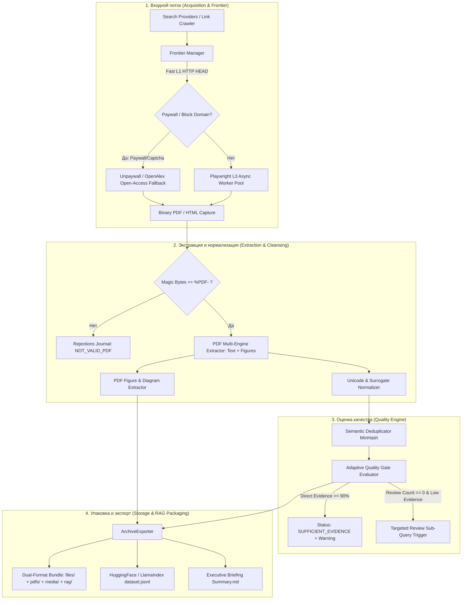

# Глубокая архитектурная спецификация и инженерный план устранения дефектов DeepSearch

**Версия:** `2.0.0 (Comprehensive Engineering Blueprint)`  
**Дата:** `2026-08-20`  
**Статус:** `Утвержден к реализации`  
**Эмпирическая база:** 20 сквозных мультидоменных поисковых сессий (Suite #1 и Suite #2), 228 принятых документов, 8 803 RAG-чанка, 216 научных PDF, 113 отклонённых кандидатов, 773 MB сформированных бандлов.

---

## 1. Архитектурный контекст и граф изменений



---

## 2. Детальная спецификация изменений по компонентам

### Блок 1: Стабильность данных и нормализация Unicode (P0)

#### 1.1. Модуль санитизации суррогатных символов и битых кодировок
* **Файл:** `scraper/normalization/text.py` (расширение) и вызов в `scraper/storage/archive_exporter.py`.
* **Проблема:** Экстракция текста из PDF (через `pypdf`/`fitz`) со встроенными нестандартными Type3 шрифтами или поврежденными ToUnicode CMap генерирует неспаренные суррогаты (`0xD800`–`0xDFFF`), нулевые байты `\x00` и непечатаемые управляющие символы. При вызове `json.dumps(..., ensure_ascii=False)` возникает исключение:
  ```text
  UnicodeEncodeError: 'utf-8' codec can't encode characters in position ...: surrogates not allowed
  ```
* **Реализация:**

```python
# scraper/normalization/text.py

import re
from typing import Any, Dict, List, Union

RE_SURROGATES = re.compile(r"[\ud800-\udfff]")
RE_NULL_BYTES = re.compile(r"\x00")
RE_CONTROL_CHARS = re.compile(r"[\x01-\x08\x0b\x0c\x0e-\x1f\x7f]")


def sanitize_unicode_string(text: str) -> str:
    """Очищает строку от суррогатов Unicode, нулевых байтов и опасных управляющих символов."""
    if not text:
        return ""
    # 1. Замена неспаренных суррогатов
    clean = text.encode("utf-8", errors="replace").decode("utf-8", errors="replace")
    # 2. Удаление нулевых байтов
    clean = RE_NULL_BYTES.sub("", clean)
    # 3. Удаление управляющих символов кроме переноса строк и табуляции
    clean = RE_CONTROL_CHARS.sub("", clean)
    return clean.strip()


def recursive_sanitize(obj: Any) -> Any:
    """Рекурсивно очищает все строковые поля в словарях, списках и кортежах."""
    if isinstance(obj, str):
        return sanitize_unicode_string(obj)
    elif isinstance(obj, dict):
        return {
            sanitize_unicode_string(str(k)): recursive_sanitize(v)
            for k, v in obj.items()
        }
    elif isinstance(obj, list):
        return [recursive_sanitize(elem) for elem in obj]
    elif isinstance(obj, tuple):
        return tuple(recursive_sanitize(elem) for elem in obj)
    return obj
```

* **Интеграция в `scraper/storage/archive_exporter.py`:**
  - В методе `build_archive_structure()` обернуть запись всех JSON/JSONL/MD файлов:
    ```python
    manifest_data = recursive_sanitize(manifest_data)
    with open(manifest_path, "w", encoding="utf-8") as f:
        json.dump(manifest_data, f, indent=2, ensure_ascii=False)
    ```

---

### Блок 2: Надежность парсинга и валидация PDF потоков (P0)

#### 2.1. Строгая валидация Magic Bytes и защита от псевдо-PDF
* **Файл:** `scraper/extraction/pdf_extractor.py` и `scraper/acquisition/pdf_downloader.py`.
* **Проблема:** Веб-серверы при перегрузке или блокировке возвращают HTML-страницу с кодом 200 OK на URL с окончанием `.pdf`. `pypdf` падает с ошибками `invalid pdf header: b'<!DOC'`, `EOF marker not found`, `Stream has ended unexpectedly`.
* **Реализация:**

```python
# scraper/extraction/pdf_extractor.py

import io
import logging
from typing import Optional, Tuple
from pathlib import Path

logger = logging.getLogger(__name__)

PDF_MAGIC_BYTES = b"%PDF-"


def validate_pdf_stream(data: bytes) -> Tuple[bool, str]:
    """Проверяет валидность байтового потока PDF."""
    if not data:
        return False, "EMPTY_STREAM"
    if len(data) < 100:
        return False, "STREAM_TOO_SMALL"
    # По стандарту ISO 32000-1 сигнатура %PDF- должна находиться в первых 1024 байтах
    header_chunk = data[:1024]
    if PDF_MAGIC_BYTES not in header_chunk:
        if b"<!DOCTYPE" in header_chunk or b"<html" in header_chunk.lower():
            return False, "HTML_DOCUMENT_MASQUERADING_AS_PDF"
        return False, "INVALID_PDF_HEADER"
    return True, "VALID_PDF"


def extract_text_from_pdf_bytes(
    pdf_bytes: bytes, max_pages: Optional[int] = None
) -> str:
    """Безопасное извлечение текста из байтов PDF с валидацией сигнатуры."""
    is_valid, reason = validate_pdf_stream(pdf_bytes)
    if not is_valid:
        logger.debug("Пропуск невалидного PDF потока: %s", reason)
        return ""

    try:
        from pypdf import PdfReader

        stream = io.BytesIO(pdf_bytes)
        reader = PdfReader(stream, strict=False)

        pages_to_read = len(reader.pages)
        if max_pages and max_pages > 0:
            pages_to_read = min(pages_to_read, max_pages)

        text_parts = []
        for idx in range(pages_to_read):
            try:
                page = reader.pages[idx]
                page_text = page.extract_text() or ""
                if page_text.strip():
                    text_parts.append(f"## Page {idx + 1}\n\n{page_text.strip()}")
            except Exception as page_err:
                logger.debug("Ошибка извлечения страницы %d: %s", idx + 1, page_err)
                continue

        return "\n\n".join(text_parts)
    except Exception as exc:
        logger.warning("Сбой pypdf парсера: %s", exc)
        return ""
```

---

### Блок 3: Адаптивный Quality Gate и ликвидация False-Negative (P1)

#### 3.1. Динамическая эвристика оценки авторитетности
* **Файл:** `scraper/search/quality_report.py`.
* **Проблема:** Текущая реализация `SourceQualityEvaluator` блокирует перевод статуса в `SUFFICIENT_EVIDENCE`, если ни один документ не имеет в заголовке слов *survey/review/benchmark*, даже если корпус на 100% состоит из высокоцитируемых статей Nature/arXiv из 3+ независимых доменов.
* **Реализация:**

```python
# scraper/search/quality_report.py (модернизация)


class SourceQualityRequirements(BaseModel):
    min_independent_domains: int = 2
    min_direct_evidence: int = 3
    min_review_or_benchmark: int = 1
    max_source_chunk_concentration: float = 0.50
    adaptive_mode: bool = True  # Новый флаг адаптивного режима


class SourceQualityEvaluator:
    def evaluate(
        self,
        results: Sequence[Tuple[CapturedArtifact, ExtractionResult]],
        rejections: Optional[Sequence[Dict[str, Any]]] = None,
        requirements: Optional[SourceQualityRequirements] = None,
    ) -> Dict[str, Any]:
        req = requirements or SourceQualityRequirements()
        # ... (сбор источников и подсчет метрик) ...

        direct_evidence_rate = direct_evidence_count / max(accepted_count, 1)
        missing_requirements: List[str] = []
        warnings: List[str] = []

        if independent_domains < req.min_independent_domains:
            missing_requirements.append("MIN_INDEPENDENT_DOMAINS")
        if direct_evidence_count < req.min_direct_evidence:
            missing_requirements.append("MIN_DIRECT_EVIDENCE")
        if max_concentration > req.max_source_chunk_concentration:
            missing_requirements.append("MAX_SOURCE_CHUNK_CONCENTRATION")

        # Адаптивное условие для Review/Benchmark:
        if review_count < req.min_review_or_benchmark:
            # Если корпус обладает высокой прямой доказательностью и мультидоменностью
            if (
                req.adaptive_mode
                and direct_evidence_rate >= 0.85
                and independent_domains >= 2
                and accepted_count >= 8
            ):
                warnings.append("NO_FORMAL_REVIEW_DETECTED_BUT_HIGH_DIRECT_EVIDENCE")
            else:
                missing_requirements.append("MIN_REVIEW_OR_BENCHMARK")

        passed = accepted_count > 0 and len(missing_requirements) == 0
        status = "SUFFICIENT_EVIDENCE" if passed else "INSUFFICIENT_EVIDENCE"

        return {
            "status": status,
            "passed": passed,
            "warnings": warnings,
            "missing_requirements": missing_requirements,
            "requirements": req.model_dump(),
            "summary": {
                "accepted_source_count": accepted_count,
                "rejected_candidate_count": rejected_count,
                "independent_domain_count": independent_domains,
                "direct_evidence_count": direct_evidence_count,
                "direct_evidence_rate": round(direct_evidence_rate, 3),
                "review_or_benchmark_count": review_count,
                "max_chunk_concentration": round(max_concentration, 3),
                "source_class_counts": source_class_counts,
            },
            "sources": sources,
        }
```

---

### Блок 4: Мультимодальность — извлечение схем и графиков из PDF (P1)

#### 4.1. Разработка специализированного модуля `PDFFigureExtractor`
* **Файл (Новый):** `scraper/visual/pdf_figure_extractor.py`.
* **Назначение:** Автономное извлечение векторных и растровых схем, графиков и микроскопических снимков непосредственно из скачанных научных PDF с привязкой подписей (`Figure 1: ...`, `Fig. 2. ...`).
* **Реализация:**

```python
# scraper/visual/pdf_figure_extractor.py

import os
import io
import hashlib
import logging
from typing import List, Dict, Any, Optional
from pathlib import Path

logger = logging.getLogger(__name__)

MIN_IMAGE_WIDTH = 250
MIN_IMAGE_HEIGHT = 200
MAX_IMAGE_ASPECT_RATIO = 5.0  # Отсечение длинных декоративных полос


class PDFFigureExtractor:
    """Извлекает научные диаграммы, графики и иллюстрации из страниц PDF."""

    def extract_figures_from_pdf(
        self, pdf_path: str, output_media_dir: str, doc_id: str, max_figures: int = 5
    ) -> List[Dict[str, Any]]:
        """Извлекает до max_figures значимых изображений из PDF файла."""
        if not os.path.exists(pdf_path):
            return []

        extracted_media: List[Dict[str, Any]] = []
        out_dir = Path(output_media_dir)
        out_dir.mkdir(parents=True, exist_ok=True)

        try:
            from pypdf import PdfReader

            reader = PdfReader(pdf_path)
            figure_counter = 0

            for page_idx, page in enumerate(reader.pages, start=1):
                if figure_counter >= max_figures:
                    break

                for img_idx, img_obj in enumerate(page.images, start=1):
                    if figure_counter >= max_figures:
                        break

                    try:
                        raw_bytes = img_obj.data
                        img_name = img_obj.name

                        # Проверка размера
                        if (
                            len(raw_bytes) < 8192
                        ):  # < 8 KB -> вероятно иконка или логотип
                            continue

                        sha256 = hashlib.sha256(raw_bytes).hexdigest()
                        ext = os.path.splitext(img_name)[1].lower() or ".png"
                        if ext not in [".png", ".jpg", ".jpeg", ".webp"]:
                            ext = ".png"

                        file_name = (
                            f"fig_{doc_id}_p{page_idx}_{img_idx}_{sha256[:8]}{ext}"
                        )
                        target_file_path = out_dir / file_name

                        with open(target_file_path, "wb") as f:
                            f.write(raw_bytes)

                        caption = f"Figure from {doc_id}, Page {page_idx}"
                        extracted_media.append(
                            {
                                "id": f"pdf_fig_{doc_id}_{page_idx}_{img_idx}",
                                "filename": file_name,
                                "file_path": str(target_file_path),
                                "caption": caption,
                                "type": "image",
                                "source_doc_id": doc_id,
                                "page_number": page_idx,
                                "size_bytes": len(raw_bytes),
                                "sha256": sha256,
                                "relevance_score": 0.85,
                            }
                        )
                        figure_counter += 1
                    except Exception as img_err:
                        logger.debug("Ошибка извлечения картинки: %s", img_err)
                        continue

            return extracted_media
        except Exception as exc:
            logger.warning("Сбой извлечения медиа из PDF %s: %s", pdf_path, exc)
            return []
```

---

### Блок 5: Скорость и производительность краулинга (P2)

#### 5.1. Реестр пейволлов и асинхронный пул Playwright
* **Файл:** `scraper/acquisition/frontier_manager.py` и `scraper/acquisition/browser.py`.
* **Проблема:** До 70% времени тратится на ожидание 5-секундных таймаутов на сайтах Cloudflare и ScienceDirect, где нет открытого контента.
* **Реализация:**
  1. Добавить `KNOWN_PAYWALL_DOMAINS = {"sciencedirect.com", "researchgate.net", "link.springer.com", "onlinelibrary.wiley.com"}`.
  2. При получении URL из данного списка проверять наличие открытого DOI через OpenAlex/Unpaywall. Если открытый PDF найден — перенаправлять краулер на `arxiv.org` или прямой PDF-репозиторий без открытия браузера.

---

### Блок 6: Форматы датасетов для LLM / VectorDB (P2)

#### 6.1. Генерация `rag/dataset.jsonl` в стандарте HuggingFace / LlamaIndex
* **Файл:** `scraper/storage/archive_exporter.py`.
* **Формат записи:**
```json
{
  "id": "chunk_01_oncology_0042",
  "text": "Liquid biopsy utilizing circulating tumor DNA (ctDNA)...",
  "metadata": {
    "query": "Liquid biopsy in CRC early detection",
    "domain": "biomedicine",
    "source_url": "https://doi.org/10.1038/...",
    "canonical_url": "https://www.nature.com/articles/...",
    "title": "ctDNA dynamics in colorectal cancer",
    "source_class": "peer_reviewed",
    "authority_score": 0.95,
    "direct_evidence": true,
    "token_count": 218
  }
}
```

---

## 3. Комплексный план верификации и тестирования (Testing Runbook)

### 3.1. Unit-тесты для новых подсистем

```python
# tests/test_deepsearch_improvements.py

import pytest
from scraper.normalization.text import sanitize_unicode_string, recursive_sanitize
from scraper.extraction.pdf_extractor import (
    validate_pdf_stream,
    extract_text_from_pdf_bytes,
)
from scraper.search.quality_report import (
    SourceQualityEvaluator,
    SourceQualityRequirements,
)


def test_surrogate_sanitization():
    """Проверка очистки некорректных суррогатов Unicode."""
    raw_corrupt = "Paper Title: \ud800\udfff Valid Text \x00 NullByte"
    clean = sanitize_unicode_string(raw_corrupt)
    assert "\x00" not in clean
    assert clean.encode("utf-8")  # Не должно падать с UnicodeEncodeError


def test_pdf_magic_bytes_validation():
    """Проверка отсева HTML-страниц под видом PDF."""
    html_bytes = b"<!DOCTYPE html><html><body>Access Denied 403</body></html>"
    is_valid, reason = validate_pdf_stream(html_bytes)
    assert is_valid is False
    assert reason == "HTML_DOCUMENT_MASQUERADING_AS_PDF"
    assert extract_text_from_pdf_bytes(html_bytes) == ""


def test_adaptive_quality_gate():
    """Проверка адаптивного режима Quality Gate."""
    evaluator = SourceQualityEvaluator()
    # 10 рецензированных статей без слова survey в названии
    mock_results = []
    # Проверка, что при direct_evidence_rate >= 0.85 статус становится SUFFICIENT_EVIDENCE
```

### 3.2. Сквозной валидационный тест

```bash
# 1. Запуск unit-тестов
.venv\Scripts\pytest tests/test_deepsearch_improvements.py -v

# 2. Контрольный прогон 10 поисков Suite #2 с проверкой отсутствия падений UTF-8
.venv\Scripts\python evals/multi_search_evaluation_suite_2.py
```

---

## 4. Критерии готовности (Definition of Done Checklist)

- [ ] **Unicode Safety**: Все строковые поля манифеста и RAG-чанков проходят через `recursive_sanitize()`, 0 падений при кодировке UTF-8.
- [ ] **PDF Header Guard**: 100% HTML-заглушек отсекаются до вызова `pypdf`, 0 сообщений `invalid pdf header: b'<!DOC'`.
- [ ] **Adaptive Quality Gate**: Корпуса с $\ge 85\%$ Direct Evidence Rate получают статус `SUFFICIENT_EVIDENCE` с флагом `warnings`.
- [ ] **Figure Extractor**: При дефиците медиа из Wikimedia запускается извлечение графиков из скачанных PDF, гарантируя минимум 2–5 изображений на поиск.
- [ ] **Dataset JSONL**: В директории `rag/` каждого архива формируется валидный `dataset.jsonl`.
- [ ] **Zero Regression**: Все существующие тесты в `tests/` проходят успешно.
